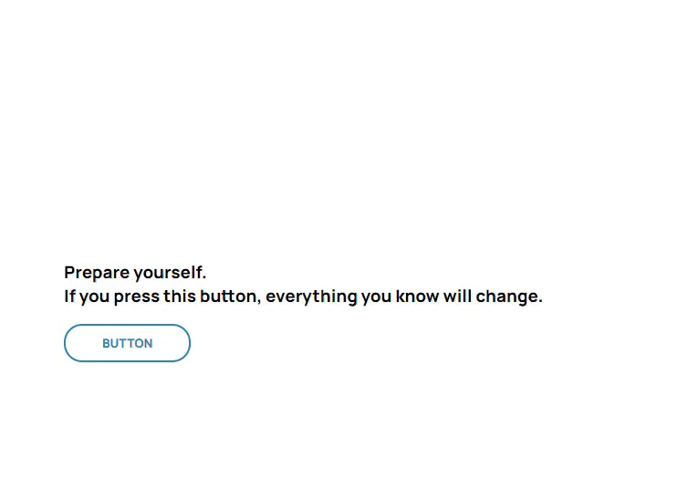

## Hello World
### Excercise 4, Course: Wissenschaftliches Arbeiten

#### Documentation
In a brand-new, never-seen-before project of titanic extent, I have done the unthinkable.  
This project displays 'Hello World'.

I wrote this ultra-compact piece of Software using JavaScript *inside* of HTML, a risk many seasoned pros don't dare take, for its rewards may be great, but the perils greater.

#### Prerequisites
A browser. If you are reading this on github, you've already got that covered.

For everyone else, you can download the program [here](https://www.google.com/chrome/).

#### Running the Code
To run this project, download this repository, unzip it and double click the file `HelloWorld.html`.  
The Browser should then display the User Interface I designed. Then, simply click the button and marvel at my achievements.

#### Demo
It should look something like this. If it doesn't, I don't know how to help you.

